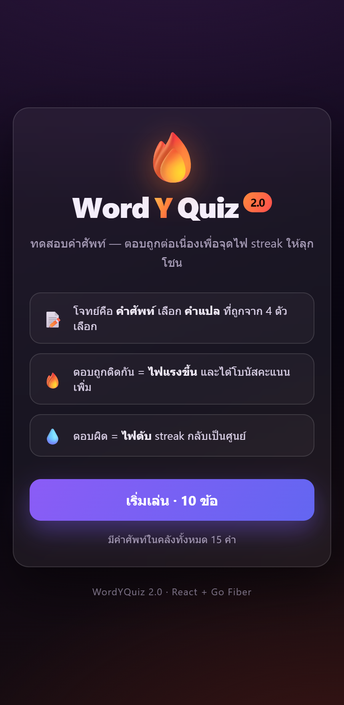
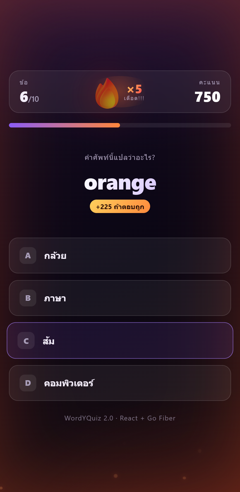
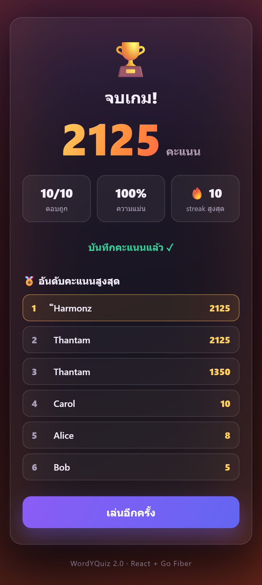

# 🔥 WordYQuiz

เกมทดสอบ **คำศัพท์** (vocabulary quiz) — โจทย์คือคำศัพท์ ผู้เล่นเลือก *คำแปล* ที่ถูกจาก 4 ตัวเลือก
ตอบถูกต่อเนื่องจะ **"ติดไฟ" (streak)** ไฟยิ่งลุกยิ่งได้โบนัสคะแนนเพิ่ม ตอบผิดไฟดับทันที

โปรเจคนี้มี 2 เวอร์ชันหน้าเว็บ ที่ใช้ **backend Go Fiber ตัวเดียวกัน**:
- **v1.0** — HTML/CSS/JS ล้วน (สร้าง 2023)
- **v2.0** — เขียนใหม่ด้วย React (สร้าง 2026)

---

## 📸 WordYQuiz 2.0

  
  
  

---

## 🧱 Tech Stack

| ชั้น | เทคโนโลยี |
|------|-----------|
| **Frontend 2.0** | React 18 · Vite · framer-motion (อนิเมชัน) · CSS (glassmorphism) |
| **Frontend 1.0** | HTML5 · CSS3 · Vanilla JavaScript (`fetch`) |
| **Backend** | Go 1.20 · [Fiber](https://gofiber.io/) v2 · [GORM](https://gorm.io/) · [Viper](https://github.com/spf13/viper) (config) · [Zap](https://github.com/uber-go/zap) (logging) |
| **Database** | PostgreSQL |
| **สถาปัตยกรรม** | REST API แบ่งชั้น handler → service → repository |

---

## ✨ ฟีเจอร์เด่น (2.0)

- 🎯 โจทย์ = คำศัพท์ · 4 ตัวเลือก = คำแปลที่สุ่มมา (1 ถูก + 3 ลวง)
- 🔥 **ระบบ streak ติดไฟ** — เปลวไฟโต/เรืองแสงตามจำนวนตอบถูกติดกัน, อนุภาคไฟลอยพื้นหลัง, พื้นหลังเรืองแดง, โบนัสคะแนนเพิ่มทุก streak
- 💧 ตอบผิด = ไฟดับ streak กลับเป็นศูนย์
- 🏆 หน้าสรุปผล: ความแม่นยำ + streak สูงสุด + บันทึกคะแนนลง DB + กระดานอันดับ

---

## 🔌 REST API

| Method | Endpoint | หน้าที่ |
|--------|----------|--------|
| `GET` | `/volcabs` | ดึงคลังคำศัพท์ทั้งหมด |
| `GET` | `/volcabs/:id` | ดึงคำศัพท์ตาม id |
| `POST` | `/volcabs` | เพิ่มคำศัพท์ |
| `GET` | `/score` | ดึงคะแนน (leaderboard) |
| `POST` | `/score` | บันทึกคะแนนใหม่ |

