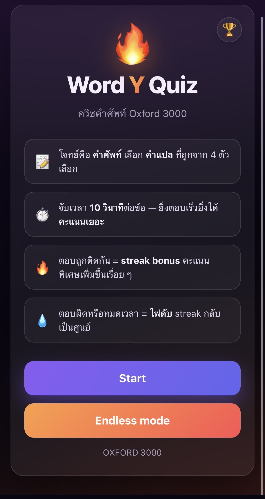
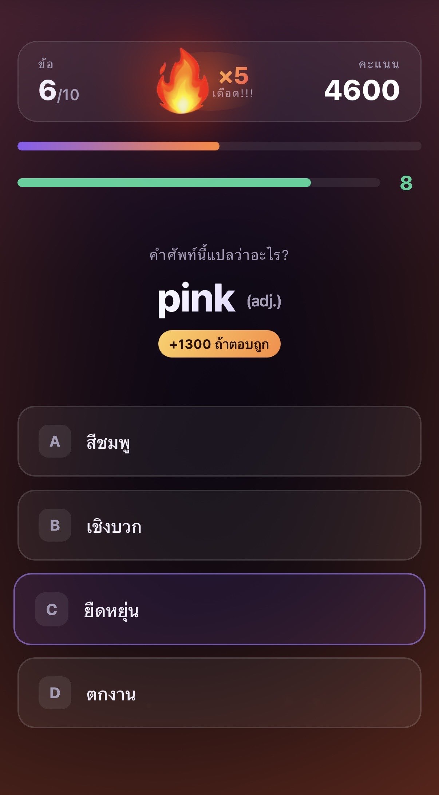
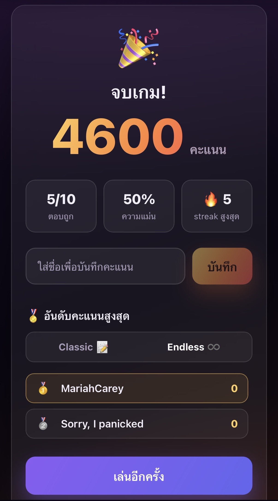

# 🔥 WordYQuiz

เกมทดสอบ **คำศัพท์** (vocabulary quiz) — ที่ได้แรงบันดาลใจแอป Toeic Zombie เกิดจากไอเดียถ้าเปลี่ยนจากคำศัพท์ toeic เป็น oxford 3000 คงจะสนุกและท้าทายขึ้น
บวกกับเกม toeic zombie ยิ่งเลเวลสูงๆ timer จะเดินไวมากจนไม่ได้โฟกัสกับคำศัพท์แต่เป็นความไวแทน WordYQuiz จะไม่เร่งให้คุณตอบขนาดนั้น แต่จะตอบแทนความเร็วของคุณด้วยคะแนนที่มากขึ้นแทน
สไตล์เดียวกับ kahoot แต่ถ้าคุณเป็นผู้เล่นสกิลภาษาระดับ C2 ที่ไม่ได้อยากแข่งกับความเร็วคุณสามารถตอบได้เรื่อยๆ เพื่อให้ได้คะแนนและเป็นตัวท็อปเซิฟ

โจทย์คือคำศัพท์ ผู้เล่นเลือก *คำแปล* ที่ถูกจาก 4 ตัวเลือก
ตอบถูกต่อเนื่องจะ **"ติดไฟ" (streak)** ไฟยิ่งลุกยิ่งได้โบนัสคะแนนเพิ่ม ตอบผิดไฟดับทันที
ยิ่งตอบไวยิ่งได้คะแนนเยอะ คะแนนจะ stack กับระบบ streak ได้
โหมดแข่งขัน:
ถ้าตอบถูกเกิน 5 ครั้งจะได้รับ extra life และได้สิทธิ์ในการตอบผิด 1 ครั้ง 

โปรเจคนี้มี 2 เวอร์ชันหน้าเว็บ ที่ใช้ **backend Go Fiber ตัวเดียวกัน**:
- **v1.0** — เป็น Demo ที่ใช้ HTML/CSS/JS ล้วน (สร้าง 2023) [เล่น WordYQuizClassic](https://word-y-quiz-v1.vercel.app)
- **v2.0** — เขียนใหม่ด้วย React (สร้าง 2026) [เล่น WordYQuiz](https://word-y-quiz.vercel.app)

---

## Tech Stack

| ชั้น | เทคโนโลยี |
|------|-----------|
| **Frontend 2.0** | React 18 · Vite · framer-motion (อนิเมชัน) · CSS (glassmorphism) |
| **Backend** | Go 1.20 · [Fiber](https://gofiber.io/) · [GORM](https://gorm.io/) · [Zap](https://github.com/uber-go/zap) (logging) |
| **Database** | PostgreSQL |
| **Clean Architecture** | REST API แบ่งชั้น handler → service → repository |
| **Deployment** | Supabase(Database) + Render(Backend) + Vercel(Frontend) |

--- 

## 📸 WordYQuiz 2.0

  
  
  

  👉 <b><a href="https://word-y-quiz.vercel.app">ลองเล่นจริงที่นี่</a></b>

---

## ฟีเจอร์เวอร์ชัน 2.0

- โจทย์ = คำศัพท์ · 4 ตัวเลือก = คำแปลที่สุ่มมา (1 ถูก + 3 ลวง)
- **ระบบ streak ติดไฟ** — เปลวไฟโต/เรืองแสงตามจำนวนตอบถูกติดกัน, อนุภาคไฟลอยพื้นหลัง, พื้นหลังเรืองแดง, โบนัสคะแนนเพิ่มทุก streak
- ตอบผิด = ไฟดับ streak กลับเป็นศูนย์
- หน้าสรุปผล: ความแม่นยำ + streak สูงสุด + บันทึกคะแนนลง DB + กระดานอันดับ

---

## 🔌 REST API

| Method | Endpoint | หน้าที่ |
|--------|----------|--------|
| `GET` | `/volcabs` | ดึงคลังคำศัพท์ทั้งหมด |
| `GET` | `/volcabs/:id` | ดึงคำศัพท์ตาม id |
| `POST` | `/volcabs` | เพิ่มคำศัพท์ |
| `GET` | `/score` | ดึงคะแนน (leaderboard) |
| `POST` | `/score` | บันทึกคะแนนใหม่ |

